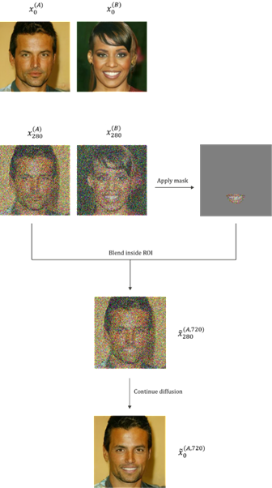
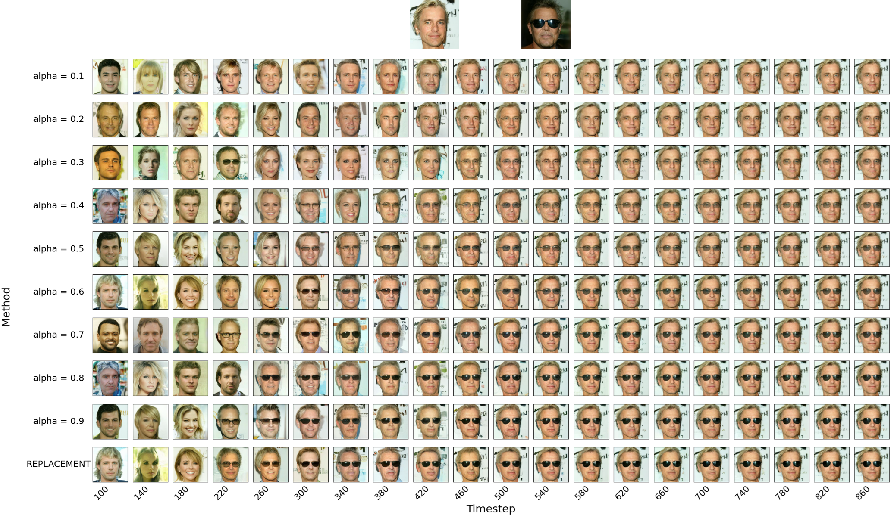

# Semantic Image Editing by Reverse Noise Trajectory Manipulation in DDPMs

This repository demonstrates localized semantic image editing in an unconditional Denoising Diffusion Probabilistic Model (DDPM) by directly manipulating intermediate states of the reverse diffusion trajectory.

The method uses the pretrained [`google/ddpm-celebahq-256`](https://huggingface.co/google/ddpm-celebahq-256) model.

The code supports two stages:

1. Generate samples from fixed seeds and save their reverse diffusion trajectories.
2. Select a recipient image and a donor image, blend a masked donor region into the recipient at different reverse-process positions, and continue denoising to obtain edited samples.

This project is a compact demonstration of the experiments developed for the diploma thesis **Data Mining from Digital Images Using Diffusion Models**.

---

## Method

Let:

- $x_t^{(A)}$ is the donor state at reverse-process position $t$,
- $x_t^{(B)}$ is the recipient state at the same position,
- $M$ is a binary spatial mask,
- $\alpha \in (0,1]$ is the donor blending strength.

The edited intermediate state is:

$$
\tilde{x}_t =
(1-M)\odot x_t^{(B)}
+
M\odot
\left(
\alpha x_t^{(A)}
+
(1-\alpha)x_t^{(B)}
\right).
$$

The reverse diffusion process then continues from $\tilde{x}_t$ until the final sample $\tilde{x}_0$ is produced.

- Outside the mask, the recipient state is unchanged.
- Inside the mask, the donor and recipient states are linearly blended.
- $\alpha = 1$ corresponds to hard replacement inside the mask.

<p align="center">
  
</p>

The diagram shows the complete workflow: sample two images, recover matching intermediate states from their saved trajectories, isolate the donor region with a mask, inject it into the recipient state, and resume the reverse diffusion process.

> **Terminology note:** the experiment files use values such as `100`, `120`, and `280` as indices into `scheduler.timesteps`. They are reverse-process step indices, not necessarily the raw DDPM timestep values.

---

## Results

Each result grid varies two parameters:

- **Rows:** blending strength \(\alpha\), from `0.1` to `0.9`, followed by hard replacement.
- **Columns:** the reverse-process position at which the masked intervention is applied.

Low \(\alpha\) values preserve more of the recipient state, while high values transfer more donor information. The intervention position controls whether the edit affects global structure, identity, or localized visual detail.

### Example 1

<p align="center">
  
</p>

### Example 2

<p align="center">
  
</p>

### Example 3

<p align="center">
  
</p>

The examples illustrate the central trade-off:

- interventions at some positions can strongly alter the generated identity or global facial structure;
- interventions at suitable intermediate positions can transfer the selected attribute while preserving more of the recipient;
- interventions very late in the reverse process may not integrate the donor region naturally;
- increasing \(\alpha\) generally strengthens the transferred attribute.

---

## Repository Structure

```text
.
├── inference.py
├── experiments.py
├── masks/
│   ├── mask_eyes.png
│   └── mask_mouth.png
├── assets/
│   ├── method_overview.png
│   ├── results_example_1.png
│   ├── results_example_2.png
│   └── results_example_3.png
├── samples/                  # generated locally;
│   ├── <recipient_seed>/
│   └── <donor_seed>/
└── experiments/              # generated locally;
```


---

## Requirements

- Python 3.9 or newer
- PyTorch
- torchvision
- Diffusers
- Pillow
- NumPy

Install the dependencies:

```bash
pip install torch torchvision diffusers pillow numpy
```

---

## 1. Run `inference.py`

The first stage generates one image for every seed supplied on the command line and saves intermediate states from the reverse diffusion trajectory.

Open a terminal in the repository directory and activate the Python environment containing the required packages.

Run inference with one or more seeds

The first run downloads the pretrained `google/ddpm-celebahq-256` model from Hugging Face. Later runs reuse the cached model.


- `--seeds`: one or more integer seeds. One final image and one trajectory folder are produced for each seed.
- `--output_root`: directory in which the seed folders are created. The default/recommended value is `samples`.
- `--save_every`: save one intermediate trajectory state every `N` reverse-process steps.
- `--num_inference_steps`: number of DDPM reverse steps. The default is `1000`.

For four samples:

```powershell
python inference.py --seeds 38 92 110 200 --output_root samples --save_every 20
```

This creates:

```text
samples/
├── 38/
│   ├── final_sample38.png
│   ├── final_sample38.pt
│   ├── metadata.json
│   └── trajectory_raw/
│       ├── x_t_tensor_0000.pt
│       ├── x_t_tensor_0020.pt
│       ├── x_t_tensor_0040.pt
│       └── ...
├── 92/
├── 110/
└── 200/
```

Inspect the generated PNG files and choose which seed will be the **recipient** and which will be the **donor**.

### Choose the trajectory-saving interval

For the default experiment sweep, use:

```powershell
--save_every 20
```

This saves positions `0, 20, 40, 60, ...`.

To save the complete trajectory, use:

```powershell
--save_every 1
```

`experiments.py` must load only positions that were actually saved.

Examples:

```python
# Inference used --save_every 20
for start_timestep_index in range(100, 900, 20):
    ...

# Inference used --save_every 40
for start_timestep_index in range(0, 1000, 40):
    ...
```

Do not request `x_t_tensor_0100.pt` after using `--save_every 40`, because position `100` was not saved.

---

## 2. Choose a Mask

The repository contains two example binary masks:

```text
masks/
├── mask_eyes.png
└── mask_mouth.png
```

Choose the mask by changing `mask_path` near the beginning of `experiments.py`:

---

## 3. Configure `experiments.py`

After inspecting the generated samples, edit these values near the beginning of `experiments.py`:

```python
recipient_seed = 38
donor_seed = 92
mask_path = "masks/mask_eyes.png"
```

- `recipient_seed`: seed of the image that will be edited.
- `donor_seed`: seed of the image providing the attribute.
- `mask_path`: choose either the eyes mask or the mouth mask.

The selected seed folders must already exist under `samples/`.

Change the `range(...)` expression in `experiments.py` to use a different interval. The requested positions must exist in both the recipient and donor trajectory folders.

```python
for start_timestep_index in range(100, 900, 20):
```

---

## 4. Run `experiments.py`

```powershell
python experiments.py
```

The default experiment evaluates ten methods:

```text
alpha = 0.1
alpha = 0.2
alpha = 0.3
alpha = 0.4
alpha = 0.5
alpha = 0.6
alpha = 0.7
alpha = 0.8
alpha = 0.9
alpha = 1.0  # hard replacement
```

For each combination, the code:

1. loads the donor and recipient tensors at the same position;
2. applies the masked blend;
3. resumes the DDPM reverse process;
4. saves the final edited image.

Example output:

```text
experiments/
└── 38-92/
    ├── 0/
    │   ├── final_sample_from_0100.png
    │   ├── final_sample_from_0120.png
    │   └── ...
    ├── 1/
    ├── ...
    └── 9/
```

---

## Evaluation

The current repository is intended as a visual and reproducible demonstration of the trajectory-manipulation method.

The thesis additionally evaluated the experiments using:

- attribute-transfer accuracy;
- identity preservation;
- Fréchet Inception Distance (FID);
- Kernel Inception Distance (KID).

Evaluation scripts and complete quantitative results are not required to run the demo.

---

## Limitations

- The method depends strongly on the intervention position.
- Early or aggressive interventions may alter global structure and identity.
- Late interventions may appear pasted or may fail to integrate naturally.
- Full DDPM sampling requires many U-Net evaluations and is computationally expensive.

---

## Model and Framework

- Pretrained model: [`google/ddpm-celebahq-256`](https://huggingface.co/google/ddpm-celebahq-256)
- Diffusion framework: [Hugging Face Diffusers](https://github.com/huggingface/diffusers)
- Base method: [Denoising Diffusion Probabilistic Models](https://arxiv.org/abs/2006.11239)

---

## Citation

```bibtex
@misc{papaefthymiou2026trajectory,
  author = {Vasileios Papaefthymiou},
  title = {Data Mining from Digital Images Using Diffusion Models},
  year = {2026},
  note = {Diploma Thesis, University of Patras}
}
```
